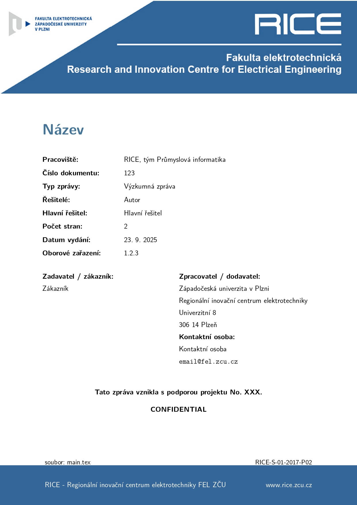

  
  
  
  
  
  

This is the official report template for the [RICE, Faculty of Electrical Engineering](https://www.rice.zcu.cz/en/) of the University of West Bohemia.

# Download

There are two possibilities of using this template:

- Download this repo and modify the `main.tex` file.
- Open the project on [Overleaf](https://www.overleaf.com/read/nhmrwnfykqpf#940003) and [create a copy](https://www.overleaf.com/learn/how-to/Copying_a_project) of it (click `Menu -> Create a copy` when logged in).

# Latex parameters

In the preamble, you need to specify either `lang=cz` or `lang=en`, wich changes the names of figures, tables, bibliography and others into the respective language.

There are multiple required parameters in the `main.tex` file: `\title`, `\author`, `\releasedate`, `\department`, `\reporttype`, `\leader`, `\reportdedication`, `\customer`, `\support`. The following parameters are optional and can be omitted: `\reportnumber`, `\classification`, `\confidential`.